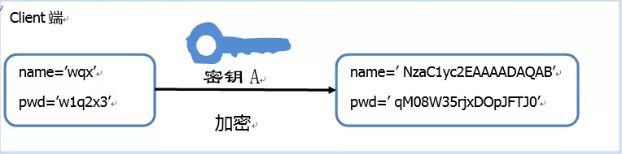
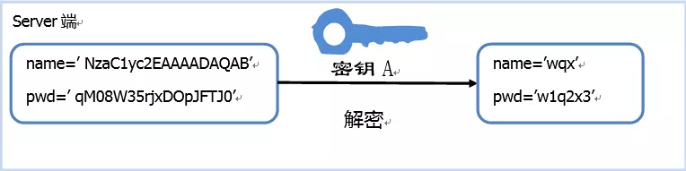
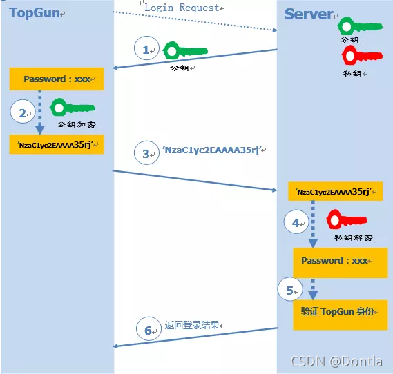

深重悼念，[Vamei](http://www.cnblogs.com/vamei)

斯人已逝，文章永存

### Linux架构

开机时，计算机从主板BIOS(basic input/output system)中读出程序，该程序的作用是使CPU对各个硬件连接识别，然后指向启动计算机的硬件位置，可以选择启动计算机的位置

之后从选定的位置读取前512个字节，称为主引导记录MBR，MBR再从指定的分区加载引导加载程序(boot loader),引导加载程序加载操作系统内核(kernel)

内核直接管理硬件，内核之上是系统调用

内核通过驱动检测硬件以后，创建一个init进程，init运行一系列初始脚本，进行准备工作，对计算机进行一系列的初始化，之后弹出登录框，允许用户以某个组的某个用户登录

linux架构：


如图，系统调用是对内和的进一步抽象，系统调用也是操作系统的原子操作，系统调用之上的封装是库函数

用`man 2 syscall`可以查看所有系统调用，也可以查看具体的系统调用说明，如`man 2 read`
(其中2代表系统调用类，具体的数字和对应的类可以用`man man`查看)

shell是一个程序，有内置的函数以及可以运行可执行文件(包括命令)，默认的shell是bash，查看用`echo $SHELL`，还有其他种类的shell
shell也是可编程的，shell脚本
shell最大的作用是高效实现各个独立程序之间的协同

---

### Linux进程

程序是指令的集合
进程是程序的执行过程，为程序执行开辟空间等
操作系统管理的是进程

可以用`ps`命令查看进程

linux的进程其实为初始init进程对自己不断调用fork复制的结果
所以进程结构为以init进程为树根的树状结构，使用`pstree`查看

子进程终结以后，退出信息会存到内核中，父进程会从内核中wait子进程，调出退出信息

如果父进程没有wait，成为孤儿进程(orphand)，父进程成为init

---

### Linux信号

Linux进程之间相互独立，信号是一种进程之间相互传递信息的方式

信号由内核或者其他进程产生，可以对信号进行执行(deliver)或者阻塞(block)

内核中对每个进程存储有一个**表**，当传递某个信号，将信号加到表中，进程在执行完系统调用后会查看表，接收信号，可以用`man 7 signal`查看信号

signal.signal(signalnum, handler)函数，第一个参数为信号宏(如SIGINT),也可以为数字(具体看`man 7 siganl`);第二个参数为处理方法(可以自定义对象或者函数)

如：

```py
#!/usr/bin/env python
import signal, time
def handler(signum, time):
    print("\nI got aSIGINT, but I am notstopping")
signal.signal(signal.SIGINT, handler)
i = 0
while True:
    time.sleep(.1)
    print("\r{}".format(i), end="")
    i += 1
```

(/r用处是光标回到行首)

```py
#!/bash/bin/env
import time
n=1

while True:
    print(n)
    time.sleep(.3)
    n=n+1
```

bg运行以后无法中断，是因为中断在while循环里运行，所以只能kill终止或者挂起

常见信号：
Ctrl+C      SIGINT
Ctrl+\      SIGQUIT
Ctrl+Z      SIGSTOP
kill -TERM \<pid>       SIGTERM(终止)

信号处理(signal disposition)有三种方式：

1. 默认(default)    SIG_DFT
2. 忽略(ignore)     SIG_IGN
3. 自定义处理

恢复暂停使用`fg`或`bg`命令，参数为$!代表上一条命令，也可以使用%n，n为jobs里查看的任务编号

`jobs`会列出当前终端中未完成的任务，可以使用`pgrep`查找pid

后缀加一个&可以让其在后台运行(但输出仍然在终端标准输出)

nohup可以让程序忽略SIGHUP信号，因为默认shell中运行的程序都是shell的子进程，所以关闭shell以后程序会默认终止，如：
`nohup sleep 2000 &`

#### 远端连接(SSH)

命令：
`ssh foo@bar.mit.edu`

其中foo是用户名，@后是服务器，服务器可以通过URL或者IP指定

ssh可以直接远程执行命令，如：
`ssh foo@server ls | grep pattern`是在本地查询远端ls命令
而`ls | ssh foo@server grep pattern`是在远端对本地ls进行查询

ssh密钥：

首先了解一下CA证书：

**CA证书**指的是CA机构为每个合法公钥持有者办法的一个数字签名证书，证书内含有分配的公钥，一个用户将验证另一个用户的真伪，可以用CA公钥对那个证书上的签字进行验证
CA将CA为其分配的公钥和申请者的信息绑在一起，并为他形成签字

其次了解一下对称加密和非对称加密(RSA)

对称加密是指client端和server端加密解密用的是同一个密钥



server对每个client分配密钥，但是容易泄露

所以用非对称加密，使用一对公钥和私钥，server端有公钥和私钥，client访问时，server将公钥给client进行加密，密文传给server以后，用私钥进行解密，再进行验证


但仍有被发送攻击者的公钥的风险(中间人攻击)，所以要根据公钥指纹认证公钥

有一种免登录的ssh方法：**公钥登录**
将client的公钥记录到server上，具体过程为登录的时候server生成随机数R，公钥加密，传给client，client私钥解密，比较是否相等

私钥位置：`~/.ssh/id_rsa`(慎重保管！)

生成一对密钥：
`ssh-keygen -o -a 100 -t ed25519 -f ~/.ssh/id_ed25519`

ssh会查询.ssh/authorized_keys来确认哪些用户允许登录
拷贝其他server的认证公钥：
`cat .ssh/id_ed25519 | ssh foo@remote 'cat >> ~/.ssh/authorized_keys'`

ssh复制文件:
`scp path/to/local_file remote_host:path/to/remote_file`

监听远程服务器需要**端口转发**


---

### 附录

---

#### fork()函数

fork()函数用于创建进程，有两个返回值，在子进程中返回0，在父进程中返回子进程PID
fork函数创建子进程的方式为：

1. 申请PID
2. 申请PCB
3. 复制父进程PCB
4. 初始化子进程
5. 复制父进程的页(使用写时拷贝，写时拷贝指对只读区域在修改的时候要拷贝一份才可以做修改)

fork函数执行的时候，一个函数会在其创建的子进程和父进程中各执行以此，但父进程和子进程那个先执行不一定，所以

---

#### 堆(OS)

操作系统中的堆指的是一段在程序运行的时候申请的内存空间，不同于栈，栈是一级缓存，用来存放函数参数名以及信息等，堆是二级缓存，程序运行结束的时候释放，程序员可以用malloc等函数申请
注意堆是在程序开始运行的时候就根据库函数申请了一段内存，OS存储堆的大小和初始地址，free()释放地址，程序员申请堆其实是在已经申请好的堆中获取存储大小，可以加速效率

#### format()函数

用于格式化字符串

1. `print("{}{}".format("hello", "world"))`
2. `site = {"name":"1", "url":"www.marvoalou.github.io"}`
`print("{name},{url}".format(**site))`
3. `list=['zxy','man']`
`print("{0[0]}{0[1]}".format(list))`
4. `print("网站名：{name}, 地址 {url}".format(name="菜鸟教程", url="www.runoob.com"))`
5. 
```py
#!/usr/bin/python
# -*- coding: UTF-8 -*-
 
class AssignValue(object):
def __init__(self, value):
    self.value = value
my_value = AssignValue(6)
print('value 为: {0.value}'.format(my_value))  # "0" 是可选的
```

6. 格式化：具体查询

#### Tmux

功能：

1. 它允许在单个窗口中，同时访问多个会话。这对于同时运行多个命令行程序很有用

2. 它可以让新窗口"接入"已经存在的会话

3. 它允许每个会话有多个连接窗口，因此可以多人实时共享会话

4. 它还支持窗口任意的垂直和水平拆分

帮助：      `Ctrl+b ?`

新建会话:       `tmux new -s <session-name>`

分离会话：      `Ctrl+b d`

查看所有会话：        `tmux ls`or`Ctrl+b s`

接入会话：      `tmux attach -t <num>or<session-name>`

结束会话：      `tmux kill-session -t <name>`

切换：      `tmux switch -t <name>`

重命名：        `tmux rename-session -t 0 <new-name>`

划分窗格：      `tmux split-window <-h>(左右)`or`Ctrl+b %`or`Ctrl+b "`

移动光标：      `tmux select-pane -U/-D/-L/-R`or`Ctrl+b 方向键`

交换位置：      `tmux swap-pane -U/-D`

其余具体看教程

#### alias

`alias ll="ls -lh"`

忽略别名：
`\ls`

禁用别名：
`unalias ll`

获取别名定义：
`alias ll`

别名放在.zshrc配置文件里

配置文件是隐藏文件，也称为点文件

常见的配置文件;
`bash` - `~/.bashrc`
`git` - `~/.gitconfig`
`vim` - `~/.vimrc`
`ssh` - `~/.ssh/config`
`tmux` - `~/.tmux.conf`

配置文件支持shell脚本，所以想要配置文件实现一些具体的功能(如在不同设备使用不同配置)，可以添加shell脚本
