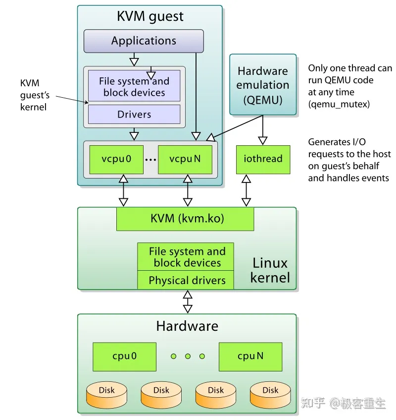
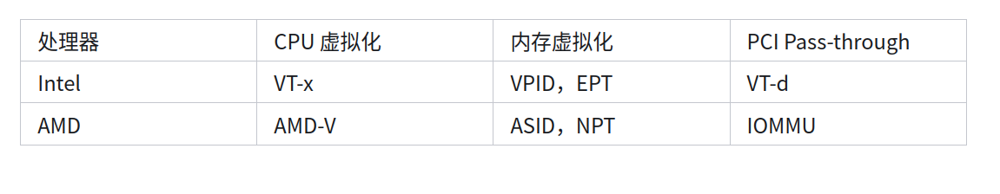

## 虚拟化技术


几个疑问：
- 为什么python,Java等要采用虚拟机来执行？
- 既然虚拟机最终要落在物理机的身上，为什么不去做和C一样的，针对编译器的适配，为什么不设计为编译执行的语言，而要加一个虚拟机中间层？

python和java等解释性语言的执行：    
源代码 - 字节码 - 解释器 - 虚拟机 - 物理机

python等易于开发的语言在设计时为了保证尽量减少底层差异对开发者的影响，对物理机做了一层虚拟机抽象，统筹和封装了硬件资源的操作，同时也隔离了python对底层硬件的操作

虚拟机跨平台的实现，是很多虚拟机是由C编写的，同时也考虑了对不同体系结构的优化和适配(提高字节码的执行效率)

C语言跨平台的实现：不同的编译器会针对特定平台和体系结构进行优化，生成不同的机器码

搭嘎，C也有虚拟机，如LLVM中的JIT(Just-in-Time)，和一些嵌入式中的实现

虚拟机化技术自1974年提出到现在，愈发常见和常用，其核心概念离不开Hypervisor(虚拟机监视器)，接下来深入探讨

### Hyervisor

有两种方案，一种是直接对硬件层的Hypervisor，在此基础上建立Guest OS，代表作有：
- KVM
- Virtual PC

相当于Hypervisor就是主操作系统，特点是高效率

另一种是在主机的OS上运行一个Hypevisor，再在其上运行Guest OS，代表作有VMWare Workstation



#### KVM



其中KVM是在支持VMX扩展模块的处理器中，能够使linux除了内核态，用户态意外多加一个客户态，客户态用来运行虚拟机，KVM可将linux内核转化为一个Hypervisor，客户态可以运行虚拟机，常见的是和QEMU搭配使用     

KVM设置了客户虚拟机的地址空间、模拟I/O和BIOS，而对显卡、网卡等抽象需要用户层的虚拟机来实现  

#### QEMU

QEMU是一个运行在用户态(或者说客户态)的虚拟机管理程序，本身提供了对许多硬件设备(如CPU)的抽象和模拟，但是性能有限，所以常和KVM搭配使用

特点是可以使用和模拟不同的指令集

用户模式可以使用不同指令集编译单个程序，也可以实现交叉编译  
系统模式可以模拟一个完整的计算机系统

其处于GUEST和HOST之间

KVM提供CPU的虚拟机扩展，以及内核层次的虚拟机支持(将内核化为Hypervisor)，QEMU使用了KVM提供的特殊系统调用等接口来进行内核设置，所以KVM是QEMU的一种特殊运行模式，能直接用主机的CPU跑任务

其关系是:   
**KVM通过QEMU来实现第一种的Hypervisor高性能支持，QEMU通过KVM来达到虚拟机的硬件加速**


## 运行

查看处理器是否支持KVM：
```bash
$ LC_ALL=C lscpu | grep Virtualization
```


